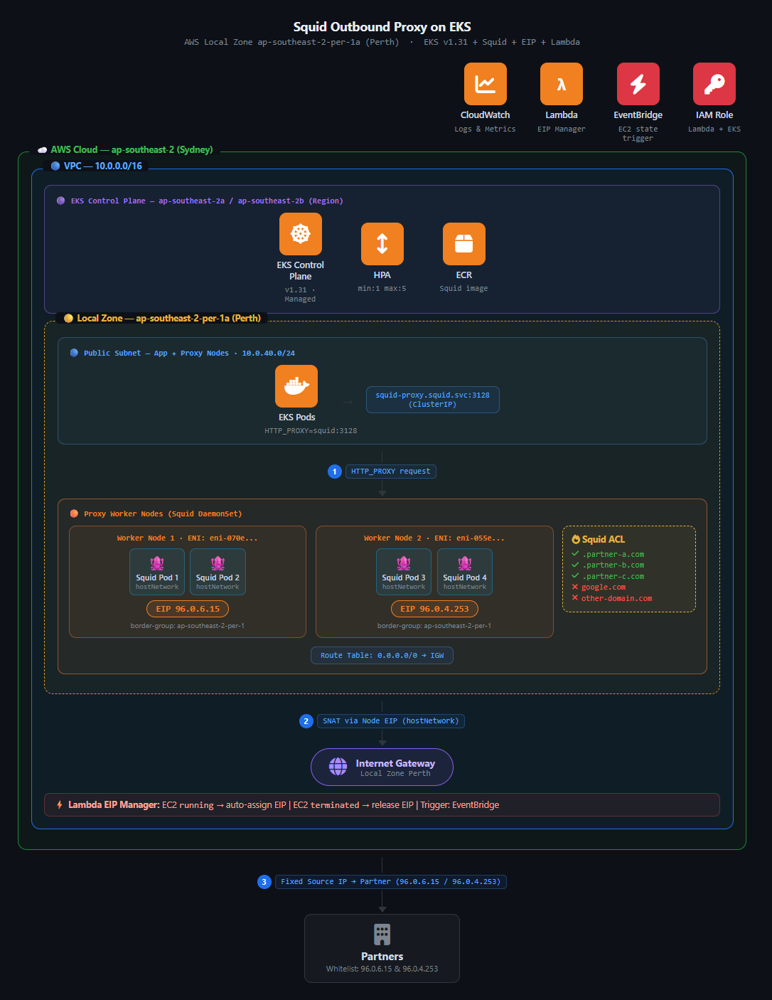

# Squid Outbound Proxy — Thay thế AWS NAT Gateway trên Local Zone

> Deploy Squid forward proxy trên EKS để thay thế NAT Gateway tại AWS Local Zone — nơi NAT Gateway không được hỗ trợ.

## Architecture



## Kiến trúc

```
App Pods (Private App Subnet 10.0.10.0/24)
  │  HTTP_PROXY=http://squid-proxy.squid.svc:3128
  ↓
Squid DaemonSet on Proxy Nodes (Public Proxy Subnet 10.0.40.0/24, hostNetwork=true)
  │  ACL whitelist domain
  │  src IP = EIP của node
  ↓
EIP cố định → IGW → Partner
```

**EKS Control Plane** chạy ở Region chính (ap-southeast-2), **Worker Nodes** chạy tại Local Zone (ap-southeast-2-per-1a).

## Cấu trúc

```
squid-outbound-proxy/
├── terraform/
│   ├── main.tf          # Providers
│   ├── variables.tf     # Biến cấu hình
│   ├── vpc.tf           # VPC, Subnets, Route Tables
│   ├── eks.tf           # EKS Cluster + Node Groups
│   ├── eip.tf           # EIP reserve + Lambda auto-assign
│   └── squid.tf         # Squid Helm release + Security Group
├── helm/
│   └── squid-proxy/     # Helm chart cho Squid DaemonSet
├── k8s/
│   └── kustomization.yaml  # Inject HTTP_PROXY vào app pods
└── docs/
    └── architecture.png
```

## Deploy

```bash
cd terraform/

# Init
terraform init

# Plan
terraform plan -var="aws_profile=<YOUR_PROFILE>"

# Apply
terraform apply -var="aws_profile=<YOUR_PROFILE>"

# Lấy EIP để gửi cho partner whitelist
terraform output proxy_eips
```

## Verify

```bash
# Update kubeconfig
aws eks update-kubeconfig --name frt-outbound-proxy --region ap-southeast-2

# Test gọi qua Squid
kubectl run curl-test --image=curlimages/curl --restart=Never -- sleep 3600
kubectl exec -it curl-test -- \
  curl -x http://squid-proxy.squid.svc.cluster.local:3128 http://ifconfig.me
# → Phải trả về EIP của proxy node ✅

# Test domain bị block
kubectl exec -it curl-test -- \
  curl -x http://squid-proxy.squid.svc.cluster.local:3128 http://google.com
# → ERR_ACCESS_DENIED ✅
```

## Thêm domain partner mới

```bash
helm upgrade squid-proxy ./helm/squid-proxy \
  --set "squid.allowedDomains[3]=.newpartner.com" \
  -n squid
```

## Cleanup

```bash
terraform destroy -var="aws_profile=<YOUR_PROFILE>"
```

## Các vấn đề thực tế gặp phải

| Lỗi | Nguyên nhân | Fix |
|-----|-------------|-----|
| `Cannot associate addresses across network border groups` | EIP Region không gắn được vào Local Zone | Allocate EIP với `--network-border-group ap-southeast-2-per-1` |
| `NLB not supported in Local Zone` | Local Zone không hỗ trợ NLB | Dùng ClusterIP thay LoadBalancer |
| `NodeCreationFailure` | Private subnet không có route ra internet lúc bootstrap | Đặt app nodes trong public subnet |
| `map_public_ip_on_launch` error | EKS yêu cầu subnet bật auto-assign public IP | Bật `map_public_ip_on_launch = true` |

## Blog

Chi tiết đầy đủ: [Tự làm NAT Gateway trên AWS Local Zone bằng Squid + EIP](https://toannd021104.github.io/devops-blog)
