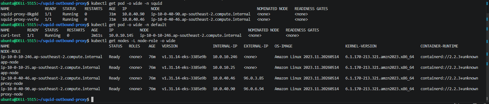
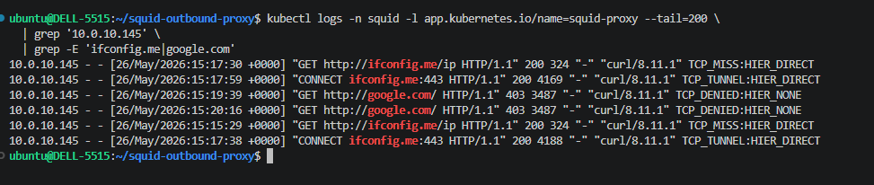

# Squid Outbound Proxy for EKS on AWS Local Zone

Squid forward proxy pattern for private EKS workloads running in an AWS Local Zone where NAT Gateway is not available.

It lets app pods stay private, route outbound HTTP/HTTPS traffic through Squid, use fixed Elastic IPs for partner whitelisting, and block non-approved domains with Squid ACLs.


## Highlights

- Fixed outbound source IPs for private EKS workloads
- Private app nodes with no public IP and no direct Internet Gateway route
- Dedicated proxy node group with one Elastic IP per proxy node
- Squid DaemonSet with `hostNetwork: true` so egress uses the node EIP
- Domain allowlist enforced by Squid ACL
- VPC endpoints for private node bootstrap without NAT Gateway
- Terraform + Helm deployment

## Overview

AWS Local Zones bring compute closer to users or on-prem systems, but they do not support every service available in the parent Region. One common limitation is outbound networking: Local Zones do not provide NAT Gateway.

In a normal Region, private application nodes often reach the internet through NAT Gateway. In this lab, the app nodes stay private and outbound traffic is forced through Squid proxy nodes instead.

Traffic flow:

```text
App Pod on private app node
  -> HTTP_PROXY / HTTPS_PROXY
  -> Squid ClusterIP Service
  -> Squid Pod on proxy node
  -> Proxy node Elastic IP
  -> Internet Gateway
  -> Partner APIs
```

## Architecture

```text
AWS Region: ap-southeast-2
VPC: 10.0.0.0/16

EKS Control Plane
  - ap-southeast-2a
  - ap-southeast-2b

AWS Local Zone: ap-southeast-2-per-1a

Private App Subnet: 10.0.10.0/24
  - App nodes
  - No public IP
  - No direct internet route

Public Proxy Subnet: 10.0.40.0/24
  - Proxy nodes
  - Squid DaemonSet
  - Elastic IPs
  - Route 0.0.0.0/0 -> Internet Gateway
```

Key components:

| Component | Purpose |
| --- | --- |
| App node group | Runs private application workloads |
| Proxy node group | Runs Squid proxy pods |
| Squid ClusterIP Service | Internal proxy endpoint for app pods |
| Elastic IPs | Fixed source IPs for partner whitelisting |
| Lambda EIP manager | Re-attaches available EIPs when proxy nodes are recreated |
| VPC endpoints | Allow private nodes to bootstrap and pull images without NAT |

## Repository Layout

```text
squid-outbound-proxy/
├── terraform/
│   ├── vpc.tf         # VPC, subnets, route tables, IGW
│   ├── endpoints.tf   # VPC endpoints for private nodes
│   ├── eks.tf         # EKS cluster and node groups
│   ├── eip.tf         # Local Zone EIPs and Lambda EIP manager
│   ├── squid.tf       # Squid Helm release
│   └── outputs.tf
├── helm/
│   └── squid-proxy/   # Squid DaemonSet, ConfigMap, Service
├── k8s/               # Example proxy env patch
└── docs/              # Architecture diagram
```

## Requirements

- AWS CLI with a configured profile
- Terraform `>= 1.5`
- kubectl
- Helm
- Access to `ap-southeast-2` and Local Zone `ap-southeast-2-per-1a`

## Quickstart

Deploy the lab:

```bash
cd terraform
terraform init
terraform plan -var="aws_profile=<YOUR_PROFILE>"
terraform apply -var="aws_profile=<YOUR_PROFILE>"
```

Read useful outputs:

```bash
terraform output cluster_name
terraform output proxy_eips
terraform output squid_service_dns
```

Update kubeconfig:

```bash
aws eks update-kubeconfig \
  --name frt-outbound-proxy \
  --region ap-southeast-2 \
  --profile <YOUR_PROFILE>
```

## Usage

Application workloads use the internal Squid service as their HTTP/HTTPS proxy:

```yaml
env:
  - name: HTTP_PROXY
    value: http://squid-proxy.squid.svc.cluster.local:3128
  - name: HTTPS_PROXY
    value: http://squid-proxy.squid.svc.cluster.local:3128
  - name: NO_PROXY
    value: localhost,127.0.0.1,10.0.0.0/8,.cluster.local,.svc
```

## Verification

The lab was verified with a debug pod running on the private app node group and Squid pods running on the public proxy node group.



Create a debug pod on an app node:

```bash
kubectl run curl-test \
  --image=curlimages/curl \
  --restart=Never \
  --overrides='{"spec":{"nodeSelector":{"node-role":"app-node"},"containers":[{"name":"curl-test","image":"curlimages/curl","command":["sleep","3600"]}]}}'
```

Direct internet access should fail because the app node is private:

```bash
kubectl exec curl-test -- \
  curl -m 5 -sS http://ifconfig.me/ip
```

Traffic through Squid should return one of the proxy node EIPs:


```bash
kubectl exec curl-test -- \
  curl -sS \
  -x http://squid-proxy.squid.svc.cluster.local:3128 \
  http://ifconfig.me/ip
```

Non-whitelisted domains should be denied:


```bash
kubectl exec curl-test -- \
  curl -sS \
  -x http://squid-proxy.squid.svc.cluster.local:3128 \
  http://google.com
```

Expected result: Squid returns `ERR_ACCESS_DENIED`.

Filter Squid logs:



```bash
kubectl logs -n squid -l app.kubernetes.io/name=squid-proxy --tail=200 | \
  grep -E 'ifconfig.me|google.com|TCP_DENIED|TCP_TUNNEL|TCP_MISS'
```

## Configuration

Allowed domains are managed in Terraform and rendered into Squid ACLs by Helm:

```hcl
variable "partner_domains" {
  description = "Domain partner được phép đi qua Squid"
  type        = list(string)
  default = [
    "ifconfig.me",
  ]
}
```

Elastic IP count should match the maximum number of proxy nodes:

```hcl
variable "eip_count" {
  default = 2
}

variable "proxy_node_max" {
  default = 2
}
```

## Cleanup

```bash
cd terraform
terraform destroy -var="aws_profile=<YOUR_PROFILE>"
```

## What This Demonstrates

- Designing EKS outbound traffic without NAT Gateway in AWS Local Zone
- Separating private app nodes and public proxy nodes
- Using fixed source IPs for partner API whitelisting
- Bootstrapping private nodes with VPC endpoints
- Enforcing outbound domain control with Squid ACL
- Automating EIP assignment with Lambda and EventBridge

## Author

Built by [toannd021104](https://github.com/toannd021104) as a DevOps/AWS networking lab.

## More Details

- Blog post: [Tự làm NAT Gateway trên AWS Local Zone bằng Squid + EIP](https://toannd021104.github.io/devops-blog)
- Architecture diagram: [docs/architecture-overview.jpg](docs/architecture-overview.jpg)
